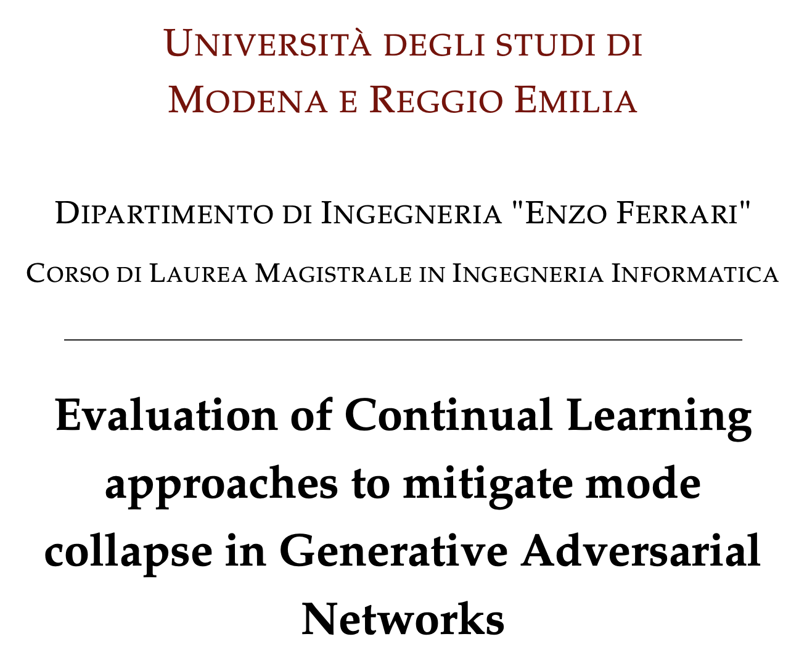

# Evaluation of Continual Learning approaches to mitigate mode collapse in Generative Adversarial Networks

https://github.com/user-attachments/assets/3f943b34-0f16-4efd-b1ae-11f04ca1093b
* The above video shows the exact moment during the training when mode collapse is mitigated thanks to experience replay. The green dots are the 8 gaussians true distribution; the blue dots are the generative model's distribution; the red dots are the discriminators "memory" provided by experience replay. *

Research thesis for the Master’s degree in Computer Engineering, whose objective is to attempt to solve the mode collapse problem in GANs by applying Continual Learning methods to the discriminator.

Thanks to Experience Replay, the discriminator retains memory of the generator’s past modes, mitigating the mode collapse problem. The blue dots represent the generator’s distribution, the red dots are the samples stored in the Experience Replay buffer, and the green dots correspond to a two-dimensional distribution of 8 Gaussians.
